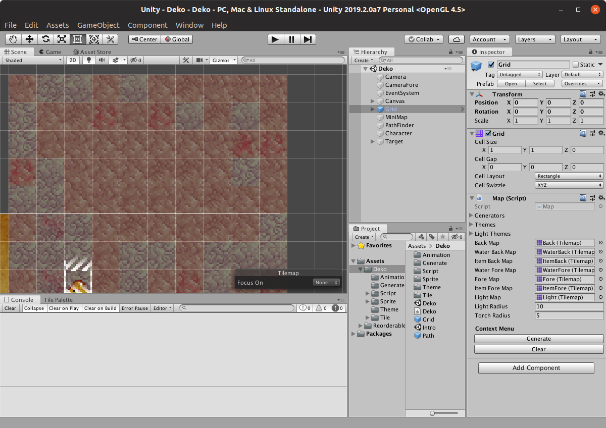

# Deko

<http://henrysoftware.itch.io>
<https://assetstore.unity.com/publishers/9216>
code: rakkarage@gmail.com
art: benmhenry@gmail.com

## Todo

- remove transform lock if not needed!?
- remove randomFlip from animation!? cuz torch gets placed and randomized by randm tile anyway! should be moved to theme with other shit?
- remove light tile!?
- custom icon and preview for RandomTile etc?
- generate levels
- save & load? (odin serializer? not working on linux?)
- mobs

## Bugs

- obelisk sync random?
- ReorderableInspector limit of 10!?
